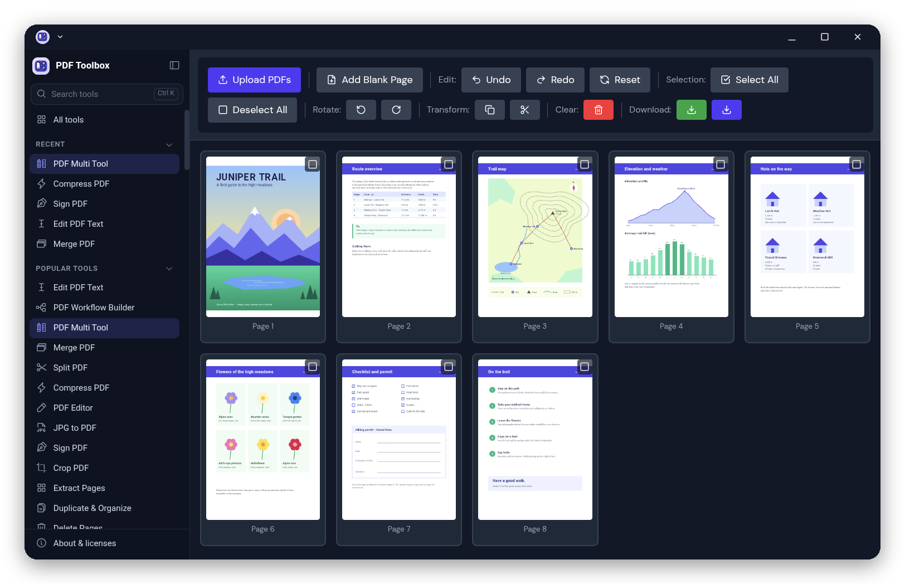
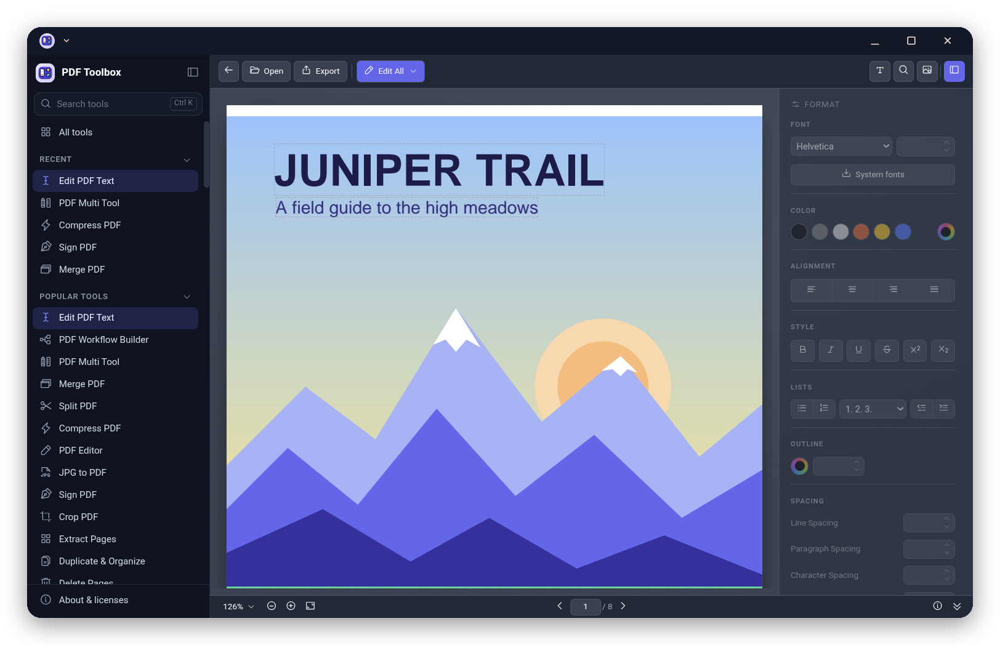
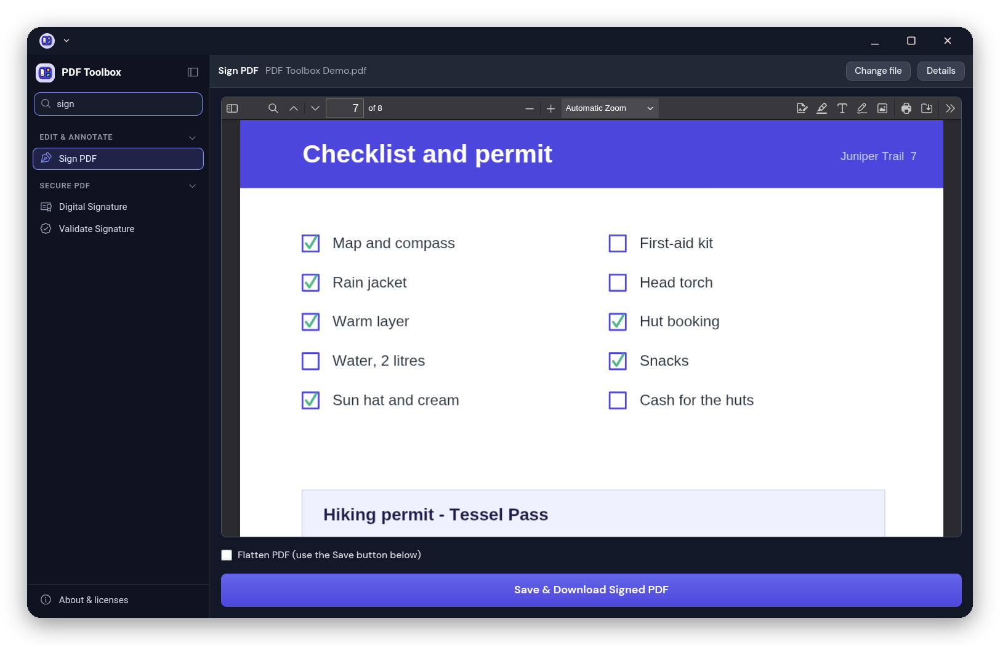
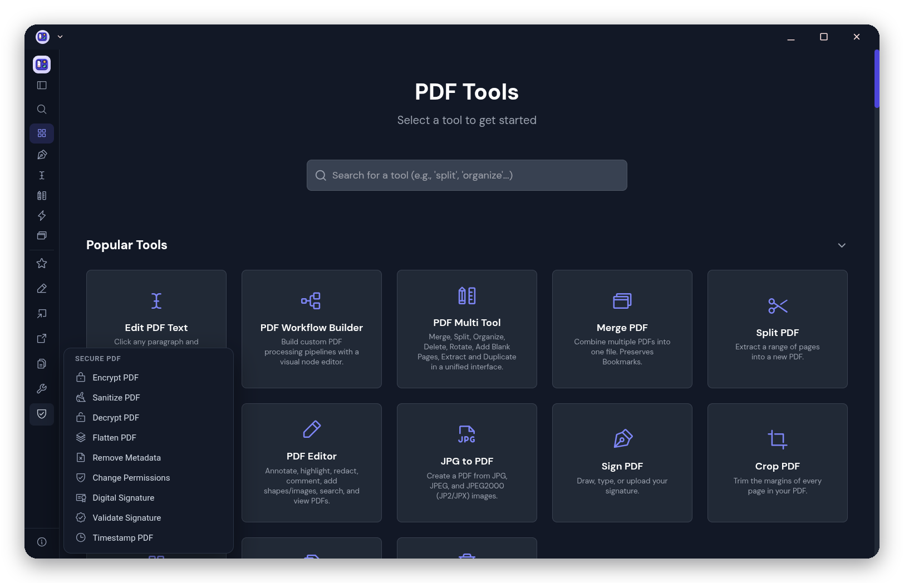

<p align="center"></p>

<h1 align="center">PDF Toolbox</h1>

<p align="center"><b>More than 100 PDF tools that run entirely on your Googlebook.</b><br>
Merge, split, edit, sign, fill forms, convert Word, Excel and PowerPoint, OCR and more:<br>
offline, in a desktop window, and your files never leave your device.</p>

<p align="center">
  <a href="https://github.com/kuscher/pdf-toolbox/releases/latest/download/PDFToolbox.apk"><b>⬇ Download PDFToolbox.apk</b></a>
  &nbsp;·&nbsp; <a href="#install">How to install</a>
  &nbsp;·&nbsp; <a href="https://github.com/kuscher/pdf-toolbox/releases">All versions</a>
  &nbsp;·&nbsp; <a href="CHANGELOG.md">What's new</a>
</p>

<p align="center">
  
  
  
  
</p>

<p align="center"><sub>A personal passion project by <a href="https://github.com/kuscher">Alexander Kuscher</a>, developed entirely on a Googlebook.
Not affiliated with or endorsed by any employer (<a href="#about-this-project">more</a>).</sub></p>

<p align="center">
  
</p>

PDF Toolbox is [BentoPDF](https://github.com/alam00000/bentopdf), the open-source,
privacy-first PDF toolkit, made into a desktop app for **Googlebooks**: every tool is
one click away in a sidebar, and opens in the full-height pane next to it. Every tool
runs on your Googlebook itself: there is no server, and the app doesn't even have
permission to use the internet. **One APK works on every Googlebook**, with an Intel
(x86_64) or an Arm (Snapdragon, MediaTek) chip.

PDF Toolbox was called BentoBook until version 0.5.

## Contents

- [What it does](#what-it-does)
- [Requirements](#requirements)
- [Install](#install) · [Update](#update) · [Uninstall](#uninstall)
- [Using it](#using-it)
- [Privacy](#privacy)
- [Limits](#limits)
- [Questions](#questions)
- [Building it yourself](#building-it-yourself)
- [About this project](#about-this-project)
- [License and credits](#license-and-credits)

## What it does

- **Organize:** merge, split, reorder, rotate, delete and extract pages. The PDF
  Multi Tool does all of it on one page grid.
- **Edit:** Edit PDF Text (click a paragraph and type), annotate, highlight, redact,
  sign, fill and create forms, add watermarks, page numbers, stamps and bookmarks,
  crop.
- **Convert:** Word, Excel, PowerPoint and OpenDocument to PDF (with LibreOffice,
  running in the app), PDF to Word, Excel, text, Markdown and images, images to
  PDF, PDF/A, EPUB, email and Markdown to PDF, and more.
- **Clean up:** OCR (make scanned PDFs searchable), compress, remove blank pages,
  deskew, encrypt and decrypt, change permissions, remove metadata.
- **Workflow Builder:** chain tools into your own pipeline.

<p align="center">
  
  <br><sub>Edit PDF Text: click a paragraph and type. Font, colour, alignment and spacing are on the right.</sub>
</p>

## Requirements

- **A Googlebook:** the Acer Googlebook 14, ASUS Googlebook 14 and Lenovo
  Googlebook 15 (Intel), the Dell XPS Googlebook and HP Googlebook 14 (Snapdragon),
  and the ones that follow. PDF Toolbox also runs on other devices with Android 14
  or later, but it is made for a laptop screen and keyboard.
- **Android System WebView, up to date** (it updates through Google Play, like
  other apps). Converting Office files to PDF needs a recent WebView; PDF Toolbox is
  tested with WebView 153. With an older one, every other tool still works.
- **About 200 MB** of storage. It is a big app because the engines come with it:
  LibreOffice, Python with PyMuPDF, Ghostscript and Tesseract OCR.

## Install

PDF Toolbox isn't in the Play Store: you install it from this page, which takes a
minute. It asks for no permissions.

1. **Download.** On your Googlebook, open this page in Chrome and click
   [**Download PDF Toolbox**](https://github.com/kuscher/pdf-toolbox/releases/latest/download/PDFToolbox.apk).
   Chrome shows a warning for every app downloaded from outside the Play Store
   ("File might be harmful"): choose **Download anyway**.
2. **Open it.** Click the download in Chrome's downloads, or open the **Files** app,
   go to **Downloads** and click **PDFToolbox.apk**.
3. **Allow installing apps from Chrome** (only the first time). Android says it
   isn't allowed to install unknown apps from this source. Click **Settings**,
   turn on **Allow from this source**, and go back. (Newer versions of Android
   ask in the same window instead: choose to allow it.)
4. **Install.** Click **Install**. Google Play Protect may offer to scan the app
   first; that's fine. When it's done, click **Open**. PDF Toolbox is in your apps
   from now on.

**Coming from BentoBook?** PDF Toolbox is its new name, and it installs as a new
app next to it: once PDF Toolbox works, uninstall BentoBook. (Files you made stay in
your Download folder.)

**Check the download** (optional): each [release](https://github.com/kuscher/pdf-toolbox/releases)
lists the APK's SHA-256 checksum. Every release (and BentoBook 0.5 before it) is
signed with the certificate whose SHA-256 fingerprint is
`98:70:15:C8:99:04:BC:8B:22:F1:B7:90:3F:95:FF:29:D9:F9:8A:09:B6:99:4D:1F:12:F2:00:51:F3:DB:C3:D0`
(`apksigner verify --print-certs PDFToolbox.apk` shows it).

**With adb** instead: `adb install PDFToolbox.apk`.

### Update

PDF Toolbox can't check for updates itself, as it has no internet permission.
**About & licenses** in the app links to this page. Download the new
**PDFToolbox.apk** and install it the same way; it installs over the old version
and keeps your settings. [What's new](CHANGELOG.md) lists the changes.

**Coming from 0.6.1 or earlier?** Those versions had a placeholder package name,
so the versions after them install as a new app next to the old PDF Toolbox
instead of updating it. Once the new one works, uninstall the old one (files you
made stay in your Download folder).

### Uninstall

Like any app: press and hold (or right-click) PDF Toolbox in your apps and choose
**Uninstall**. Files you saved stay in your Download folder.

## Using it

- **The sidebar** lists every tool by category, with your **Recent** tools at the
  top. Click a tool and it opens in the pane on the right; the sidebar stays, so
  you can go straight from one tool to the next. **All tools** shows them all on
  one page.
- **Search** with **Ctrl+K**: type part of a tool's name or what it does
  ("split", "word", "sign"), use the arrow keys and press **Enter**.

<p align="center">
  
  <br><sub>Search finds tools as you type; Sign PDF shows the page to sign with its own toolbar.</sub>
</p>

- **More room:** **Ctrl+B** or the button at the top of the sidebar folds it into a
  slim row of icons; each category's icon opens its tools. In a narrow window the
  sidebar folds by itself and opens over the tool when you need it.

<p align="center">
  
  <br><sub>Folded: your recent tools and the categories as icons. Each category opens as a menu.</sub>
</p>
- **Pick a tool, then a file:** click the drop area and choose files, or drag
  them in from the Files app.
- **From the Files app:** open a PDF with PDF Toolbox, or share any supported file
  (PDF, images, Word, Excel, PowerPoint, OpenDocument, EPUB, email) to it. A bar
  says the file is waiting; open a tool and the file goes straight in.
- **Once your file is in,** the tool's page folds its title and drop area into a
  slim header: the tool, your file, **Change file** (or **Add files**) and
  **Details**, which shows the folded part again. Editors (Sign, PDF
  Editor, Crop, Form Filler, Stamps and others) and the PDF Multi Tool fill the
  pane, with their toolbar and buttons in view.
- **Results** are saved to your **Download** folder. A bar at the bottom shows the
  name, with **Open** (in your PDF viewer) and **Show** (in Files).
- **Back** (the back key or gesture) goes back to the previous tool.
- **About & licenses**, at the bottom of the sidebar, shows the version, the
  licenses and where the source code is.

### Live window resizing

Android normally hides a window behind a plain veil with the app's icon while you
resize it, and redraws it when you let go. Google switches that off for its own
apps, and you can switch it off for PDF Toolbox too, so the page follows the window
edge as you drag. It takes one command from a computer with adb, with
[Wireless debugging](https://developer.android.com/tools/adb#connect-to-a-device-over-wi-fi)
paired:

```sh
adb shell am compat enable ENABLE_FLUID_RESIZING io.github.kuscher.pdftoolbox
```

Then close and reopen PDF Toolbox. `am compat reset ENABLE_FLUID_RESIZING io.github.kuscher.pdftoolbox`
undoes it. The setting stays when you update PDF Toolbox.

## Privacy

PDF Toolbox has no internet permission, so Android doesn't let it connect to
anything. Your files are processed in the app, on your Googlebook, and saved
where you choose. There are no accounts, ads, analytics or crash reports. Links
to websites (such as this page) open in your browser.

## Limits

- **OCR reads English.** More languages mean a bigger app; you can
  [build](#building-it-yourself) one with others (`OCR_LANGS=eng,deu`).
- **Nothing that needs the internet:** trusted timestamps and certificate checks
  for digital signatures don't work.
- **Very large files** can run out of memory. PDF Toolbox then reloads the tool list
  and says so.
- **A few long option forms** (Posterize, Edit Metadata) still scroll a little.

## Questions

**Why isn't it in the Play Store?** It may be one day. For now the APK comes from
this page, with its source next to it.

**Is it safe to install an app from outside the Play Store?** Install PDF Toolbox
only from this page, whose releases are signed with the key shown under
[Install](#install). PDF Toolbox asks for no permissions and can't use the internet.
Its complete source code is here.

**Why is it so big?** BentoPDF's engines run in the app: LibreOffice (78 MB),
Python with PyMuPDF (41 MB), Tesseract OCR (20 MB) and Ghostscript (11 MB).

**Intel or Arm?** Both, with the same APK. The engines are WebAssembly, which
runs the same on either, and the app has no native code.

**Will installing get harder?** Google has announced that from 2027 Android will
ask for apps installed from outside the Play Store to come from verified
developers. Until then nothing changes; this page will say what to do if you
need to.

**Something doesn't work?** [Open an issue](https://github.com/kuscher/pdf-toolbox/issues)
with the tool, what you did and your Googlebook model.

## Building it yourself

PDF Toolbox builds on Linux, on x86_64 or arm64, without Android Studio or Gradle:

```sh
sudo apt install aapt zipalign apksigner default-jdk-headless git python3 curl
./build.sh fetch    # once: Android build bits and Node.js
./build.sh          # BentoPDF's web app (the first time) and build/PDFToolbox.apk
```

`tools/webapp.sh` builds BentoPDF offline (every engine served from the app);
[docs/DESIGN.md](docs/DESIGN.md) explains how the app works, and
[docs/TESTING.md](docs/TESTING.md) what is tested and how. `./ptb` has the
developer commands for a Googlebook over adb (`./ptb app` builds, installs and
opens it; `./ptb smoke` runs the main engines end to end).

**Signing.** Release builds are signed with the release key, which is never in
this repository: `build.sh` looks for `keystore.jks` and its password in
`keystore.pass` in `~/.config/pdf-toolbox` (or `$PDFTOOLBOX_KEYS`). Without them it
signs with a test key of its own, which is fine for trying a build, but such an
APK can't update a PDF Toolbox installed from a release. The maintainer keeps a
backup of the release key; lose it and existing installs can't be updated.

**Releases.** `./ptb release` checks the APK (version, release key) and makes
the release files: the APK, a source archive and checksums;
`./ptb release --publish` tags the version and publishes it on GitHub.
`tools/aab.sh` makes the Android App Bundle (`build/PDFToolbox.aab`) Google Play
takes instead of the APK, signed with the same key; the app's package name is
`io.github.kuscher.pdftoolbox`.

**Testing on x86_64.** The [x86_64 workflow](.github/workflows/x86_64.yml)
builds PDF Toolbox on an x86_64 machine and runs `tools/smoke.py` in Google's
x86_64 Android emulator (Android 16: the SDK's Android 17 images crash under the
emulator's software rendering).

## About this project

PDF Toolbox is my personal passion project, made on my own: it is not affiliated
with, sponsored by or endorsed by my employer, and nothing here speaks for them. It
isn't made or endorsed by the BentoPDF authors or by Google either.

It is developed entirely on a Googlebook, an HP Googlebook 14, in the Googlebook's
built-in Linux Terminal. Some of the fun parts:

- **The Terminal's Debian builds everything:** BentoPDF's web app with Node.js and
  Vite, and the APK with Debian's aapt2, javac, zipalign and apksigner and Google's
  D8. No Android Studio, no Gradle.
- **The Googlebook tests itself:** adb over Wireless debugging reaches from the
  Terminal to the Android side of the same laptop, and a small Chrome DevTools
  Protocol client drives the app's WebView: the smoke test runs real conversions,
  and the layout survey opens all 79 PDF tools and measures them.
- **Big engines in a WebView:** LibreOffice, Ghostscript, Tesseract and Python with
  PyMuPDF run as WebAssembly, served from inside the APK, with SharedArrayBuffer
  switched on by androidx.webkit's cross-origin isolation allowlist.
- **x86_64 without an x86 laptop:** GitHub Actions builds the APK on x86_64 and
  runs it in Android's x86_64 emulator.
- **The icon is drawn in code** (`tools/icon.py`): Material 3 Expressive vector
  layers, themed icon included.

<sub>With a little help from Claude.</sub>

## License and credits

**PDF Toolbox's own code** (everything in this repository apart from the
third-party license texts in `licenses/`) is under the [MIT License](LICENSE): use
it for anything, keep the notice.

**The app** contains BentoPDF, which is © the BentoPDF authors and licensed under
the GNU Affero General Public License v3 (AGPL-3.0), and engines under their own
licenses: AGPL-3.0 (PyMuPDF and MuPDF, Ghostscript, CoherentPDF), GPL, LGPL, MPL,
Apache, BSD, MIT and OFL (fonts). So **the app as a whole is distributed under the
AGPL-3.0**: you may use, study, share and change it, and whoever gives you the app
must give you its source too. Each release comes with its complete source, and
**[THIRD_PARTY_NOTICES.md](THIRD_PARTY_NOTICES.md)** lists every component with its
version, license, copyright holders and source. The app shows the same under
**About & licenses**. PDFs made with PDF Toolbox keep BentoPDF's producer line.

**Thanks** to the people behind [BentoPDF](https://github.com/alam00000/bentopdf)
and the projects it builds on: [LibreOffice](https://www.libreoffice.org),
[PyMuPDF and MuPDF](https://pymupdf.io) and [Ghostscript](https://ghostscript.com)
by Artifex, [CoherentPDF](https://www.coherentpdf.com),
[Tesseract](https://github.com/tesseract-ocr/tesseract) and
[tesseract.js](https://github.com/naptha/tesseract.js), [PDF.js](https://mozilla.github.io/pdf.js/),
[PDFium](https://pdfium.googlesource.com/pdfium/) and [EmbedPDF](https://www.embedpdf.com),
[pdf-lib](https://pdf-lib.js.org), [qpdf](https://qpdf.sourceforge.io),
[libvips](https://www.libvips.org), [Pyodide](https://pyodide.org) and many more.

**Trademarks.** BentoPDF is the name of the BentoPDF authors' project. Googlebook
and Android are trademarks of Google LLC. LibreOffice is a registered trademark of
The Document Foundation. Ghostscript and MuPDF are trademarks of Artifex Software,
Inc. Other names are trademarks of their owners, used here only to say what
PDF Toolbox contains and where it runs.
